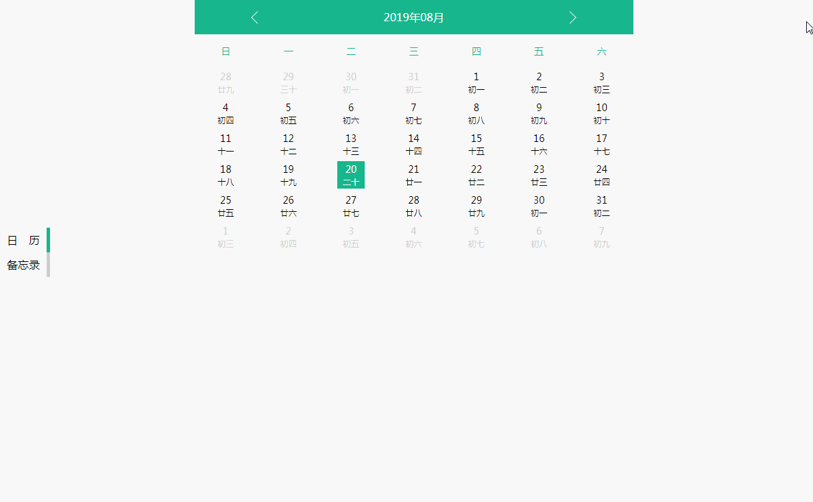

## 日历组件

> 亮点

```bash
1、原生JavaScript实现，无须引入第三方

2、支持农历显示，可根据需要开启或关闭，默认开启

3、支持中、西方模式，可根据喜好自行切换，默认西方模式

4、其他亮点，不再一一罗列，请自行发掘
```

> 效果



> 注意事项

```bash
1、CSS代码使用Scss编写

2、所有数据和组件均在src/components文件夹下，以文件夹划分

3、todo组件数据为随机模拟数据，可根据业务需求自行定制和扩展
```

## Project setup

```
pnpm install
```

### Compiles and hot-reloads for development

```
pnpm run dev
```

### Compiles and minifies for production

```
pnpm run build
```
